```{r setup, include=FALSE}
knitr::opts_chunk$set(echo = FALSE, warning = FALSE, message = FALSE)
library(ggplot2)
library(tidyverse)
library(knitr)
```

# Overview

The METABRIC (Molecular Taxonomy of Breast Cancer International Consortium) dataset is a large, well-characterized breast cancer cohort with genomic, transcriptomic, and clinical information for 1,904 patients diagnosed with primary breast cancer. It integrates patient metadata, RNA gene-expression levels, and somatic mutation profiles, providing a rich resource to study molecular subtypes, prognostic biomarkers, and genetic mechanisms of tumor progression.

The version used in this project contains 693 variables: 31 clinical variables, 489 gene-expression variables, and 173 mutation-status variables. The dataset (METABRIC_RNA_Mutation.csv) was downloaded from Kaggle (https://www.kaggle.com/datasets/raghadalharbi/breast-cancer-gene-expression-profiles-metabric).

Given the high-dimensional nature of RNA-seq data, dimensionality reduction and clustering methods are required to identify meaningful patient subgroups.

The analysis workflow includes data preprocessing, demographic and clinical overview, PCA and clustering, survival analysis, and visualization of variable genes, tumor stage, and mutation patterns across patient clusters.

The primary objective of this project was to determine whether clusters derived from tumor gene expression profiles could explain observed survival differences among breast cancer patients.

This report summarizes the integrative analysis of the METABRIC Breast Cancer Patient RNA sequencing and mutation dataset.


## 1. Data Overview

### Age Distribution

The histogram below shows the distribution of patient ages at diagnosis. The median age is 61.8 years, consistent with the typical age range for breast cancer onset.

```{r age-distribution, echo=FALSE}
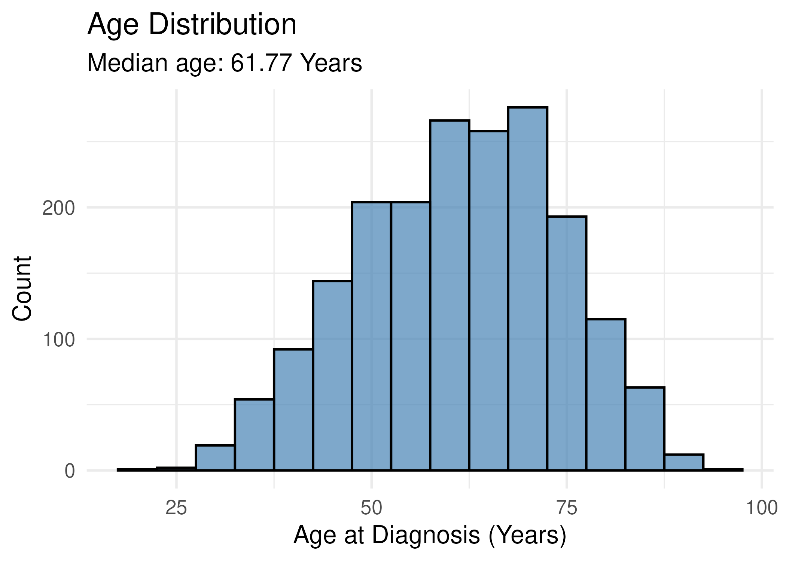
```

### Survival time Distribution

Overall survival in months is plotted below. The median survival time is 115.6 months, providing a baseline for subsequent survival analyses.

```{r survival-distribution, echo=FALSE}
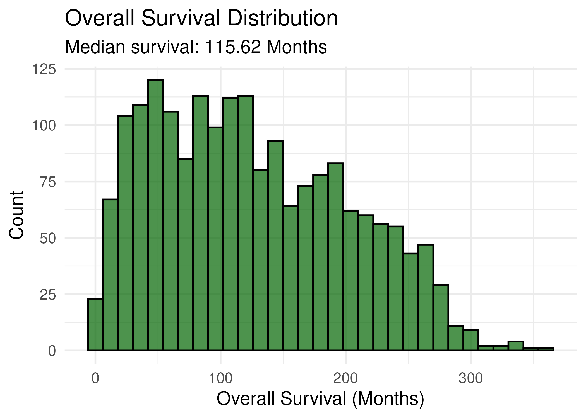
```

### Tumor Stage Distribution

Distribution of tumor stages shows that most patients have stage 2 tumors, which helps contextualize downstream analyses of survival differences across clusters.

```{r tumor-stage-distribution, echo=FALSE}
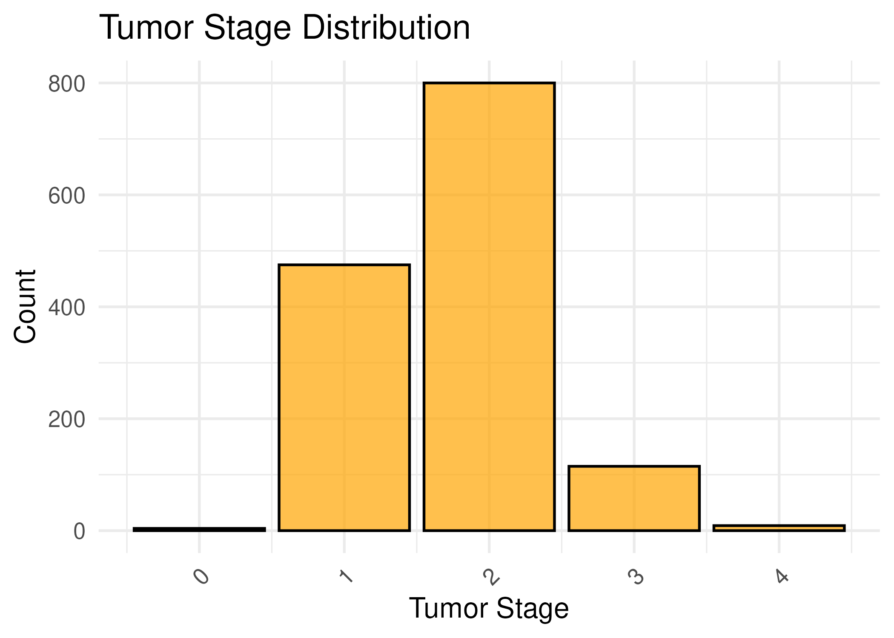
```

## 2. PCA and Clustering

### PCA Scree Plot

Principal Component Analysis (PCA) reduces high-dimensional RNA-seq data into a few uncorrelated variables (principal components) that capture the majority of variance. This simplification enables visual exploration and downstream analyses such as clustering.

PCA was performed using all 489 gene expression variables. The scree plot below shows the proportion of variance explained by each component. The first two components capture most of the variance and were used for visualization and clustering.


```{r screeplot, echo=FALSE}
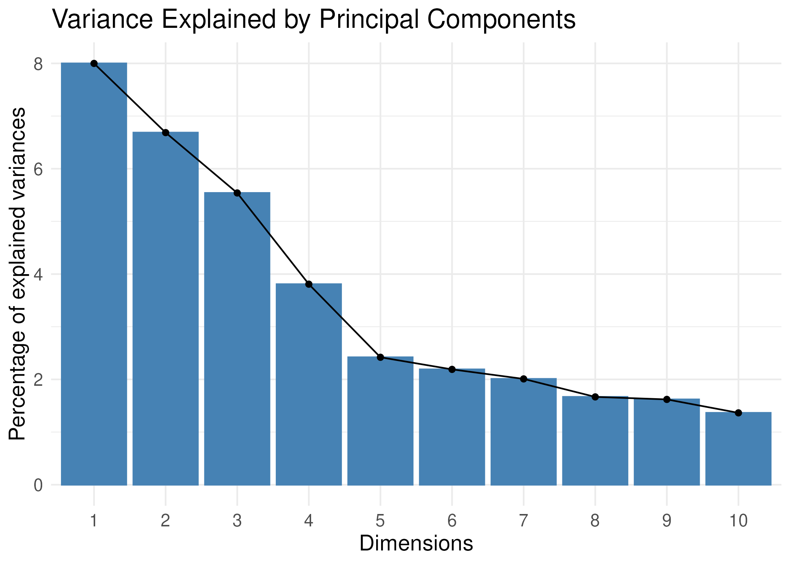
```

### Elbow Method & Gap Statistic

k-Means clustering was applied to the PCA scores. PCA helps reduce noise and highlight major patterns, making k-means more effective for RNA-seq data.

The Elbow Plot shows the total within-cluster variation versus cluster number; the “elbow” indicates a reasonable cluster count. The Gap Statistic compares clustering against random data to identify the number of clusters that best captures the data structure.

Both methods suggested four clusters (k = 4), which balance capturing meaningful patient heterogeneity while avoiding overfitting. These clusters were used for downstream PCA visualization, survival analysis, and mutation/tumor stage comparisons.

```{r elbow-plot, echo=FALSE}
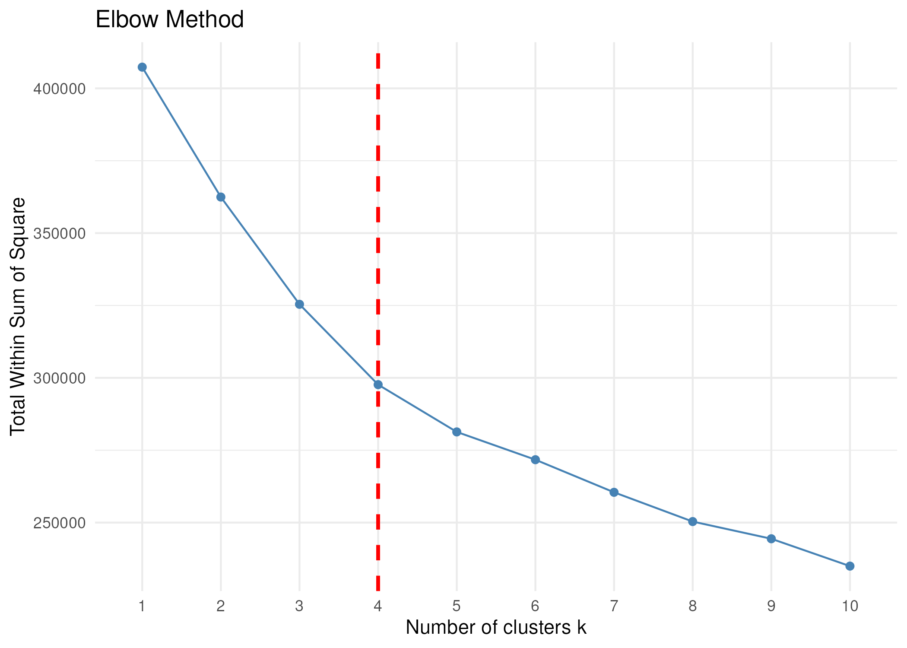
```

```{r gap-statistics, echo=FALSE}
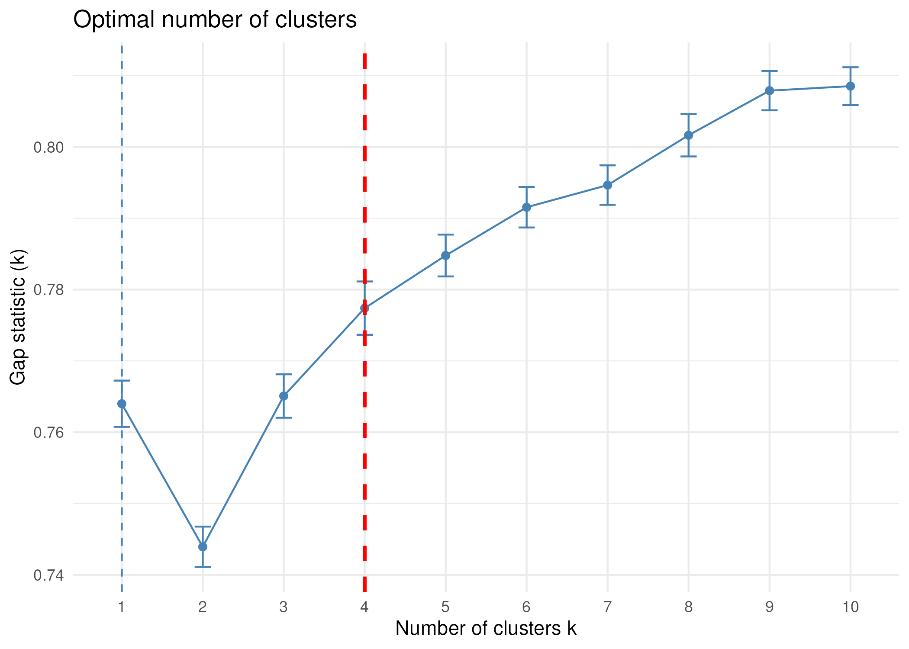
```


### PCA Clusters

The scatter plot shows patients projected onto the first two principal components and colored by k-means clusters. Most samples are concentrated in a large cluster, but the four identified clusters are reasonably distinct, indicating meaningful separation of gene expression patterns.

```{r pca-clusters, echo=FALSE}
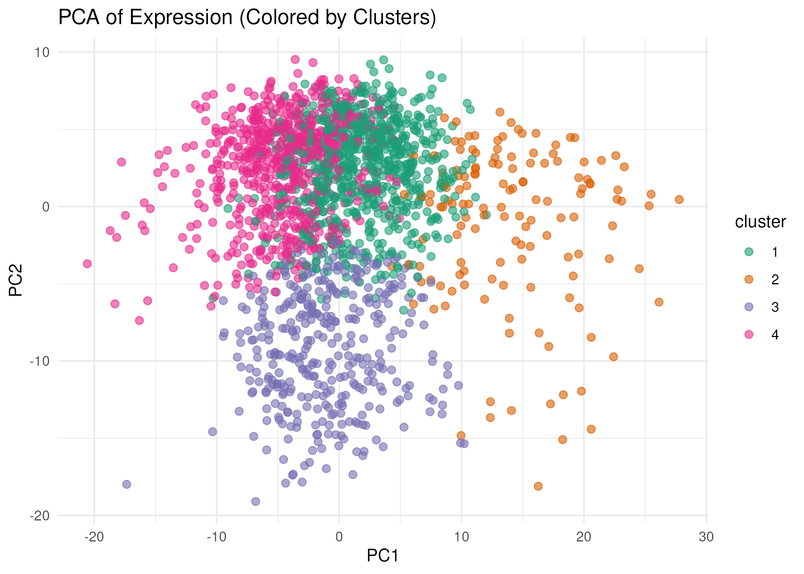
```

## 3. Survival Analysis

Kaplan-Meier (KM) plots estimate overall survival probabilities over time. KM curves were generated for the four patient clusters to investigate whether gene expression-based clusters explain survival differences.

The plot shows significant separation among clusters (log-rank p-value < 0.05), with cluster 2 patients exhibiting better survival than the rest. These findings prompted further investigation of tumor stage and gene mutation patterns as potential explanations.


```{r survival-by-cluster, echo=FALSE}
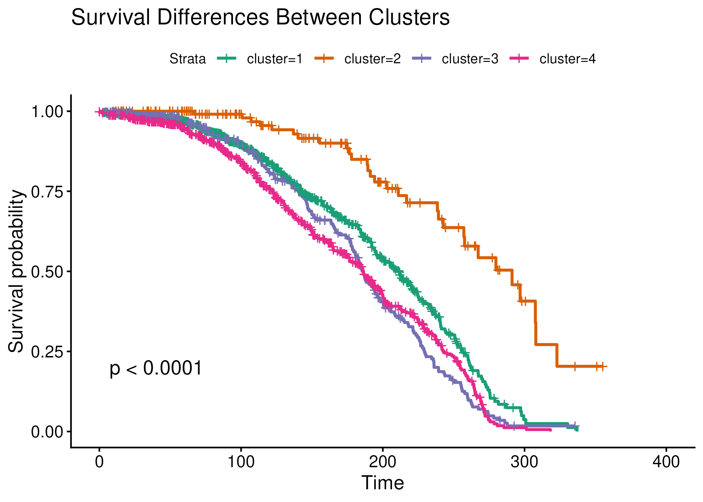
```

## 4. Variable Genes Heatmap

The heatmap shows expression of the 50 most variably expressed genes across samples (columns = samples, rows = genes). Red indicates high gene expression, blue indicates low gene expression. K-means cluster assignments are annotated above each sample.

Hierarchical clustering of samples largely recapitulates k-means clusters, demonstrating that gene expression profiles are distinct across clusters. Notably, MYC and JAK1 show lower expression in cluster 2, which corresponds to better overall survival. MYC is a known oncogene linked to proliferation and poor prognosis [PMID: 22028330], and JAK1 is part of the JAK/STAT pathway implicated in metastasis [PMID: 23722119]. Lower expression of these genes in cluster 2 may contribute to improved outcomes, although these associations are exploratory.


```{r variable-gene-heatmap, echo=FALSE}
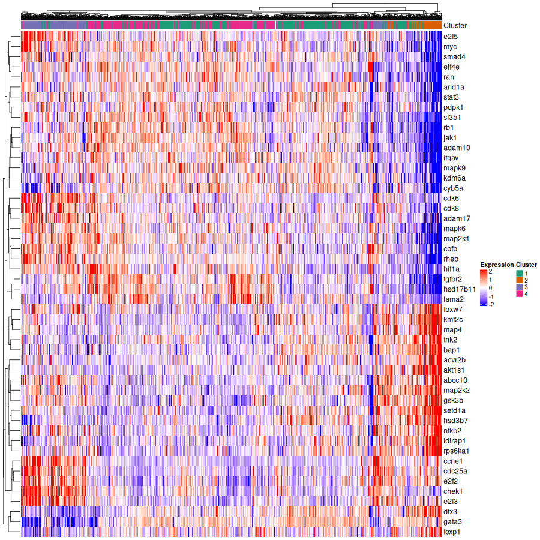
```

## 5.Tumor Stage & Mutation Analysis

### Tumor Stage Distribution by Cluster

To evaluate whether survival differences correlate with clinical characteristics, we examined tumor stage across clusters. Most patients are stage 1 or 2, with very few in higher stages. This limited variation does not fully explain the superior survival observed in cluster 2.


```{r tumor-stage-by-cluster, echo=FALSE}
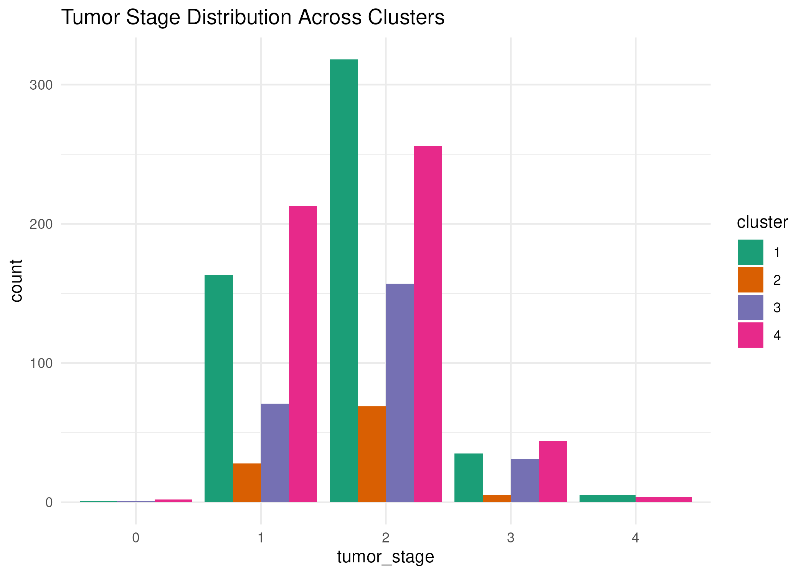
```

### Top Mutations by Cluster

We examined the 20 most frequently mutated genes and their distribution across clusters. Mutation patterns differ among clusters: TP53 and PIK3CA mutations are more frequent in clusters 1, 3, and 4, which have worse survival compared to cluster 2. Cluster 2 has fewer of these mutations, possibly explaining its better outcomes.

TP53 mutations are associated with aggressive subtypes and poor prognosis [PMID: 20173069]. PIK3CA mutations influence tumor progression and therapy response [PMID: 26276827]. Together with gene expression patterns, mutation profiles help explain the observed survival differences.


```{r top-mutations-by-cluster, echo=FALSE}
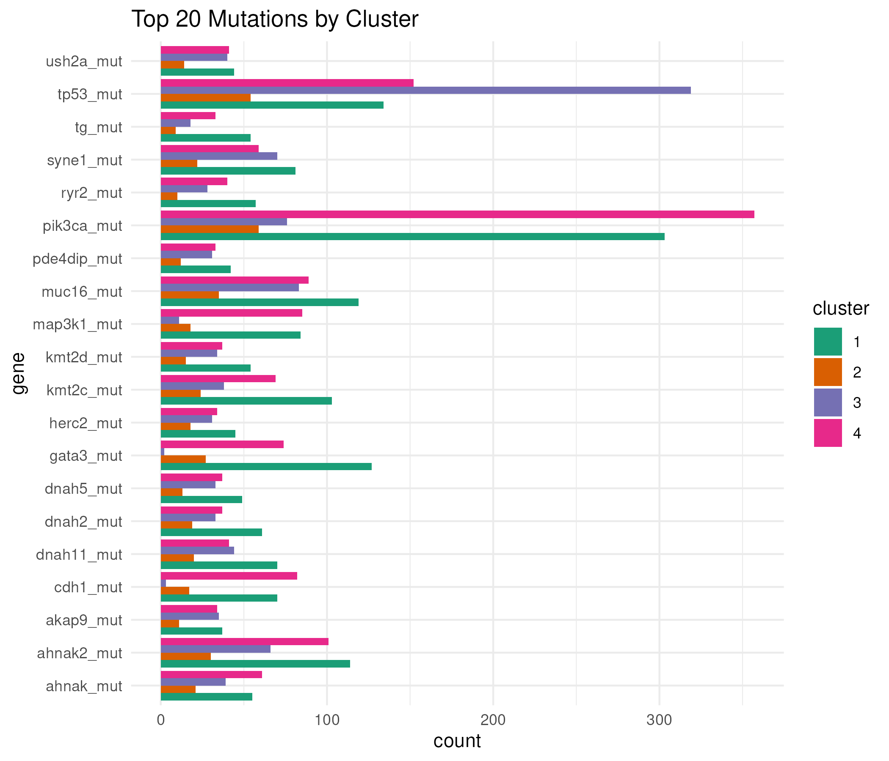
```

# Conclusion

The integrative analysis of METABRIC RNA-seq and mutation data highlights distinct patient clusters based on tumor gene expression profiles. PCA and k-means clustering identified four clusters, with cluster 2 showing notably better overall survival. Differences in gene expression patterns, particularly lower levels of MYC and JAK1, as well as reduced mutation burden in TP53 and PIK3CA, may contribute to this observation. Tumor stage distribution alone does not fully explain survival differences.

These results suggest that molecular heterogeneity, reflected in both gene expression and mutational profiles, may underlie the observed survival variation among breast cancer patients. While these findings are exploratory, they provide insights into potential mechanisms linking gene expression patterns and clinical outcomes, and underscore the value of integrative analyses for understanding breast cancer biology.
